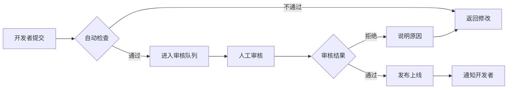

# VR 游戏平台 - 后台管理系统

## 一、角色权限管理

### 1.1 角色定义

- **超级管理员**：全部权限
- **管理员**：游戏、用户、内容管理
- **版主**：内容审核、用户管理
- **编辑**：游戏发布、文章编辑
- **客服**：用户问题处理

### 1.2 权限矩阵

| 功能模块 | 超级管理员 | 管理员 | 版主 | 编辑 | 客服 |
| -------- | ---------- | ------ | ---- | ---- | ---- |
| 用户管理 | ✅         | ✅     | ⚠️   | ❌   | ⚠️   |
| 游戏管理 | ✅         | ✅     | ❌   | ✅   | ❌   |
| 内容审核 | ✅         | ✅     | ✅   | ⚠️   | ❌   |
| 数据分析 | ✅         | ✅     | ⚠️   | ⚠️   | ⚠️   |
| 系统配置 | ✅         | ⚠️     | ❌   | ❌   | ❌   |
| 财务管理 | ✅         | ✅     | ❌   | ❌   | ❌   |

> ✅ 完全访问 | ⚠️ 只读访问 | ❌ 无权限

## 二、数据分析大屏

### 2.1 核心 KPI 指标卡片

```
┌──────────────┐ ┌──────────────┐ ┌──────────────┐ ┌──────────────┐
│ 总用户数     │ │ 日活用户     │ │ 总游戏数     │ │ 今日收入     │
│ 125,487      │ │ 8,234        │ │ 1,456        │ │ ¥12,580      │
│ ↑ 12.5%      │ │ ↑ 8.3%       │ │ ↑ 5.2%       │ │ ↑ 15.8%      │
└──────────────┘ └──────────────┘ └──────────────┘ └──────────────┘
```

### 2.2 数据图表

#### 用户增长趋势（ECharts 折线图）

```javascript
{
  title: { text: '用户增长趋势' },
  xAxis: { data: ['1月', '2月', '3月', '4月', '5月', '6月'] },
  yAxis: { type: 'value' },
  series: [{
    name: '新增用户',
    type: 'line',
    data: [1200, 2300, 3600, 5200, 7800, 10500],
    smooth: true
  }]
}
```

#### 游戏类型分布（饼图）

```javascript
{
  title: { text: '游戏类型分布' },
  series: [{
    type: 'pie',
    radius: ['40%', '70%'],
    data: [
      { value: 335, name: '动作冒险' },
      { value: 234, name: '解谜益智' },
      { value: 178, name: '社交互动' },
      { value: 156, name: '运动健身' },
      { value: 98, name: '恐怖惊悚' }
    ]
  }]
}
```

#### 收入统计（柱状图）

```javascript
{
  title: { text: '月度收入统计' },
  xAxis: { data: ['1月', '2月', '3月', '4月', '5月', '6月'] },
  yAxis: { type: 'value', name: '收入(万元)' },
  series: [{
    type: 'bar',
    data: [45, 58, 72, 88, 95, 112],
    itemStyle: {
      color: new echarts.graphic.LinearGradient(0, 0, 0, 1, [
        { offset: 0, color: '#83bff6' },
        { offset: 1, color: '#188df0' }
      ])
    }
  }]
}
```

### 2.3 实时数据

- **在线用户数**：WebSocket 实时更新
- **今日下载量**：每 5 分钟刷新
- **实时收入**：支付成功后即时更新
- **服务器状态**：CPU、内存、磁盘使用率

## 三、游戏管理

### 3.1 游戏列表

#### 列表字段

| 字段     | 说明               | 操作                 |
| -------- | ------------------ | -------------------- |
| 游戏封面 | 缩略图             | -                    |
| 游戏名称 | 标题+副标题        | 可点击查看详情       |
| 开发商   | 开发者名称         | 可点击查看开发者主页 |
| 分类     | 游戏类型           | 标签展示             |
| 价格     | 售价               | 行内编辑             |
| 状态     | 草稿/审核中/已发布 | 下拉选择             |
| 评分     | 平均评分           | 只读                 |
| 下载量   | 总下载数           | 只读                 |
| 发布时间 | 上架日期           | 只读                 |
| 操作     | -                  | 编辑/删除/预览       |

#### 批量操作

- ☑️ 批量上架/下架
- ☑️ 批量修改分类
- ☑️ 批量导出数据
- ☑️ 批量删除（软删除）

### 3.2 游戏发布/编辑

#### 基本信息

```
游戏名称：_______________
副标题：_______________
开发商：[下拉选择]
发行商：_______________
发布日期：[日期选择器]
```

#### 描述信息

```
简短描述（150字以内）：
[文本框]

完整描述：
[富文本编辑器 - Markdown支持]

游戏特色（最多5个）：
• _____________
• _____________
• _____________
```

#### 分类与标签

```
主分类：[单选] 动作冒险 / 解谜益智 / ...
子分类：[多选] 射击 / 格斗 / 冒险 / ...
自定义标签：[输入框 - 回车添加]
年龄分级：[下拉] 3+ / 7+ / 12+ / 16+ / 18+
```

#### 媒体资源

```
游戏封面：[上传按钮] - 推荐尺寸 1920x1080
截图（最多10张）：[拖拽上传区域]
宣传视频：[视频URL输入框]
预告片：[视频URL输入框]
```

#### 技术信息

```
支持平台：☑️ Quest  ☑️ PSVR  ☑️ PC VR
支持语言：☑️ 简体中文  ☑️ 英文  ☑️ 日文

最低配置：
  CPU：_______________
  内存：_______________
  显卡：_______________
  存储空间：_______________

推荐配置：
  CPU：_______________
  内存：_______________
  显卡：_______________
  存储空间：_______________
```

#### 定价设置

```
定价类型：⦿ 免费  ⦿ 付费  ⦿ 订阅

[如果付费]
价格：¥ _______________
折扣价：¥ _______________ (可选)
折扣截止日期：[日期选择器]
```

#### 下载链接

```
平台      URL                版本号      操作
Quest    [输入框]            v1.0.0     [删除]
PSVR     [输入框]            v1.0.0     [删除]
PC VR    [输入框]            v1.0.0     [删除]
                            [+ 添加平台]
```

### 3.3 游戏审核流程



#### 审核要点

- ✅ 游戏信息完整性
- ✅ 媒体资源质量
- ✅ 内容合规性
- ✅ 下载链接有效性
- ✅ 版权证明材料

## 四、用户管理

### 4.1 用户列表

#### 搜索筛选

```
关键词搜索：[搜索框] - 支持用户名、邮箱、ID搜索
状态筛选：[下拉] 全部 / 正常 / 已封禁 / 待激活
角色筛选：[下拉] 全部 / 普通用户 / 开发者 / VIP
注册时间：[日期范围选择器]
```

#### 用户列表字段

| 字段     | 说明         | 操作                |
| -------- | ------------ | ------------------- |
| 头像     | 用户头像     | -                   |
| 用户名   | 用户名+ID    | 可点击查看详情      |
| 邮箱     | 注册邮箱     | -                   |
| 角色     | 用户角色     | 可修改              |
| 状态     | 正常/封禁    | 可切换              |
| 注册时间 | 账号创建时间 | -                   |
| 最后登录 | 最近登录时间 | -                   |
| 操作     | -            | 详情/编辑/封禁/删除 |

### 4.2 用户详情页

#### 基本信息

```
用户ID：123456789
用户名：张三
邮箱：zhangsan@example.com
手机：138****5678
注册时间：2024-01-15 10:30:25
最后登录：2024-12-02 20:15:43
账号状态：[正常 ▼]
```

#### VR 游戏数据

```
拥有游戏数：25 款
总游戏时长：186.5 小时
成就解锁数：148 个
用户等级：Lv.12
总消费金额：¥1,258.00
```

#### 社交数据

```
粉丝数：523
关注数：189
发帖数：45
评论数：256
```

#### 操作记录

```
[时间轴展示]
2024-12-02 20:15  登录系统
2024-12-02 19:30  购买游戏《Half-Life: Alyx》
2024-12-02 18:45  发表评论
2024-12-01 22:10  登录系统
...
```

### 4.3 用户行为分析

#### 活跃度趋势

```javascript
// ECharts热力图
{
  title: { text: '用户活跃度热力图' },
  xAxis: { data: ['周一', '周二', '周三', '周四', '周五', '周六', '周日'] },
  yAxis: { data: ['0-6时', '6-12时', '12-18时', '18-24时'] },
  series: [{
    type: 'heatmap',
    data: [[0,0,5], [0,1,8], [0,2,15], [0,3,12], ...]
  }]
}
```

#### 留存率分析

```javascript
// 留存率柱状图
{
  title: { text: '用户留存率' },
  xAxis: { data: ['次日', '3日', '7日', '14日', '30日'] },
  yAxis: { name: '留存率(%)', max: 100 },
  series: [{
    type: 'bar',
    data: [65, 52, 45, 38, 32]
  }]
}
```

## 五、内容审核

### 5.1 审核队列

#### 待审核列表

| 类型 | 内容预览          | 提交者   | 提交时间 | 优先级 | 操作 |
| ---- | ----------------- | -------- | -------- | ------ | ---- |
| 游戏 | [封面] 游戏名称   | 开发者 A | 2 小时前 | 🔴 高  | 审核 |
| 评论 | "这游戏真不错..." | 用户 B   | 5 小时前 | 🟡 中  | 审核 |
| 帖子 | "新手指南攻略"    | 用户 C   | 1 天前   | 🟢 低  | 审核 |

#### 审核详情页

```
审核内容：
[内容完整展示]

审核选项：
⦿ 通过
⦿ 拒绝

拒绝原因（如果拒绝）：
☐ 内容违规
☐ 虚假信息
☐ 侵犯版权
☐ 垃圾广告
☐ 其他：[文本框]

审核备注：
[文本框]

[提交审核] [稍后处理]
```

### 5.2 举报处理

#### 举报列表

| 举报内容 | 举报类型 | 举报人 | 被举报人 | 状态   | 操作 |
| -------- | -------- | ------ | -------- | ------ | ---- |
| 评论内容 | 骚扰     | 用户 A | 用户 B   | 待处理 | 处理 |
| 游戏信息 | 虚假宣传 | 用户 C | 开发者 D | 处理中 | 查看 |

#### 举报类型

- 垃圾信息
- 骚扰行为
- 不当内容
- 侵犯版权
- 虚假信息
- 其他

#### 处理结果

- ✅ 举报成立 - 删除内容/封禁用户
- ❌ 举报不成立 - 驳回举报
- ⚠️ 需进一步调查

## 六、财务管理

### 6.1 收入统计

#### 总览

```
今日收入：¥12,580.00  ↑ 15.8%
本月收入：¥358,420.00  ↑ 22.3%
总收入：¥5,234,890.00
```

#### 收入来源分布

```javascript
// 饼图
{
  title: { text: '收入来源分布' },
  series: [{
    type: 'pie',
    data: [
      { value: 2580000, name: '游戏销售' },
      { value: 1200000, name: 'VIP会员' },
      { value: 850000, name: '广告收入' },
      { value: 604890, name: '其他' }
    ]
  }]
}
```

### 6.2 订单管理

#### 订单列表

| 订单号 | 用户 | 商品     | 金额 | 支付方式 | 状态   | 时间     | 操作 |
| ------ | ---- | -------- | ---- | -------- | ------ | -------- | ---- |
| ORD001 | 张三 | 游戏 A   | ¥68  | 微信     | 已支付 | 2 小时前 | 详情 |
| ORD002 | 李四 | VIP 月卡 | ¥30  | 支付宝   | 已支付 | 3 小时前 | 详情 |

#### 退款管理

| 退款单号 | 原订单号 | 用户 | 金额 | 原因   | 状态   | 操作 |
| -------- | -------- | ---- | ---- | ------ | ------ | ---- |
| REF001   | ORD003   | 王五 | ¥68  | 不喜欢 | 待审核 | 处理 |

## 七、系统配置

### 7.1 站点设置

```
站点名称：VR游戏平台
站点Logo：[上传]
站点描述：[文本框]
关键词：VR游戏,虚拟现实,VR平台
备案号：京ICP备xxxxxx号
联系邮箱：admin@example.com
客服电话：400-xxx-xxxx
```

### 7.2 功能开关

```
☑️ 允许用户注册
☑️ 允许用户评论
☑️ 启用论坛功能
☑️ 启用支付功能
☐ 维护模式
```

### 7.3 SEO 设置

```
首页标题：[输入框]
首页描述：[文本框]
首页关键词：[输入框]
Google Analytics ID：[输入框]
百度统计代码：[文本框]
```

### 7.4 邮件配置

```
SMTP服务器：smtp.example.com
SMTP端口：465
发件人邮箱：noreply@example.com
发件人密码：[密码框]
[测试邮件发送]
```

### 7.5 存储配置

```
存储方式：⦿ 本地存储  ⦿ 阿里云OSS  ⦿ 腾讯云COS

[如果云存储]
AccessKey ID：[输入框]
AccessKey Secret：[密码框]
Bucket名称：[输入框]
CDN域名：[输入框]
```

## 八、日志管理

### 8.1 操作日志

| 时间             | 操作人   | IP 地址       | 操作内容       | 结果 |
| ---------------- | -------- | ------------- | -------------- | ---- |
| 2024-12-02 20:15 | 管理员 A | 192.168.1.100 | 发布游戏《XX》 | 成功 |
| 2024-12-02 19:30 | 管理员 B | 192.168.1.101 | 封禁用户       | 成功 |

### 8.2 错误日志

| 时间             | 级别  | 模块     | 错误信息 | 堆栈追踪 |
| ---------------- | ----- | -------- | -------- | -------- |
| 2024-12-02 20:10 | ERROR | 支付模块 | 支付超时 | [查看]   |

### 8.3 登录日志

| 时间             | 用户 | IP 地址       | 设备           | 状态 |
| ---------------- | ---- | ------------- | -------------- | ---- |
| 2024-12-02 20:15 | 张三 | 192.168.1.105 | Chrome/Windows | 成功 |
| 2024-12-02 20:10 | 李四 | 192.168.1.106 | Safari/macOS   | 失败 |
