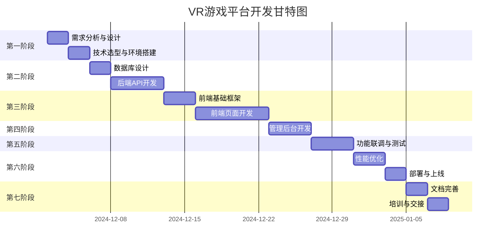

# VR 游戏平台 - 项目排期与里程碑

## 一、项目总览

### 1.1 项目周期

- **总工期**：8 周
- **开始日期**：2024 年 12 月 2 日
- **预计完成**：2025 年 1 月 27 日

### 1.2 团队配置

- **前端开发**：1 人
- **后端开发**：1 人（可复用）
- **UI 设计**：使用 Element Plus + TailwindCSS
- **测试**：开发自测
- **运维**：自动化部署（Vercel）

## 二、开发阶段划分

## 三、详细排期

### 第一阶段：需求与设计（2 天）

**时间**：12 月 2 日 - 12 月 3 日

#### 任务清单

- [x] 竞品分析完成
- [x] PRD 文档编写
- [x] 数据库 ER 图设计
- [x] API 接口文档设计
- [x] 原型图设计（使用 Figma/即兴）
- [x] 技术架构确定

#### 交付物

- ✅ 产品需求文档（PRD）
- ✅ 技术架构文档
- ✅ 数据库设计文档
- ✅ API 接口文档
- ✅ 页面原型图

---

### 第二阶段：环境搭建（2 天）

**时间**：12 月 4 日 - 12 月 5 日

#### 任务清单

- [ ] 初始化前端项目（Vue3 + Vite + TS）
- [ ] 初始化后端项目（Node.js + Express + TS）
- [ ] 配置代码规范（ESLint + Prettier）
- [ ] 配置 Git 仓库
- [ ] 搭建 PostgreSQL 数据库
- [ ] 配置 Redis 缓存
- [ ] 配置开发环境

#### 交付物

- ✅ 可运行的前端脚手架
- ✅ 可运行的后端脚手架
- ✅ 数据库连接成功
- ✅ Redis 连接成功

---

### 第三阶段：数据库与后端 API（7 天）

**时间**：12 月 6 日 - 12 月 12 日

#### Week 1: 数据库设计（2 天）

**12 月 6 日 - 12 月 7 日**

**任务**：

- [ ] 创建所有数据表
- [ ] 设置索引和约束
- [ ] 编写初始化 SQL 脚本
- [ ] 插入测试数据
- [ ] 测试数据库性能

#### Week 1-2: 后端 API 开发（5 天）

**12 月 8 日 - 12 月 12 日**

**Day 1-2：认证模块**

- [ ] 用户注册接口
- [ ] 用户登录接口
- [ ] JWT 令牌生成
- [ ] 刷新令牌机制
- [ ] 密码加密存储

**Day 3-4：游戏模块**

- [ ] 游戏列表接口（分页、筛选、排序）
- [ ] 游戏详情接口
- [ ] 游戏搜索接口
- [ ] 游戏发布接口
- [ ] 游戏更新/删除接口

**Day 5：用户模块**

- [ ] 用户资料接口
- [ ] 用户游戏库接口
- [ ] 好友系统接口
- [ ] 用户统计接口

#### 交付物

- ✅ 完整的数据库结构
- ✅ 核心 API 接口实现
- ✅ API 文档（Swagger/Postman）
- ✅ 单元测试（>=60%覆盖率）

---

### 第四阶段：前端开发（10 天）

**时间**：12 月 13 日 - 12 月 22 日

#### Week 2: 基础框架（3 天）

**12 月 13 日 - 12 月 15 日**

**Day 1：项目架构**

- [ ] 路由配置
- [ ] 状态管理（Pinia）
- [ ] API 封装（Axios）
- [ ] 通用组件开发
- [ ] 布局组件开发

**Day 2：样式系统**

- [ ] TailwindCSS 配置
- [ ] 全局样式定义
- [ ] 主题变量配置
- [ ] 响应式断点设置

**Day 3：工具函数**

- [ ] 格式化工具
- [ ] 验证工具
- [ ] 缓存工具
- [ ] 日期处理工具

#### Week 2-3: 前台页面（7 天）

**12 月 16 日 - 12 月 22 日**

**Day 1：首页**

- [ ] 英雄区轮播
- [ ] 游戏分类导航
- [ ] 热门推荐板块
- [ ] ECharts 数据可视化

**Day 2：游戏列表页**

- [ ] 游戏卡片组件
- [ ] 筛选器组件
- [ ] 分页组件
- [ ] 排序功能

**Day 3：游戏详情页**

- [ ] 游戏信息展示
- [ ] 媒体轮播
- [ ] 评论列表
- [ ] 购买流程

**Day 4：用户中心**

- [ ] 个人资料页
- [ ] 游戏库管理
- [ ] 好友系统
- [ ] 订单管理

**Day 5：社区论坛**

- [ ] 板块列表
- [ ] 帖子列表
- [ ] 帖子详情
- [ ] 发帖/回复功能

**Day 6：搜索功能**

- [ ] 搜索框组件
- [ ] 搜索结果页
- [ ] 高级搜索
- [ ] 搜索历史

**Day 7：移动端适配**

- [ ] 响应式布局调整
- [ ] 移动端导航
- [ ] 触摸手势支持
- [ ] 性能优化

#### 交付物

- ✅ 前台所有页面完成
- ✅ 移动端适配完成
- ✅ 用户体验流畅

---

### 第五阶段：管理后台（4 天）

**时间**：12 月 23 日 - 12 月 26 日

#### Day 1：后台框架

- [ ] 后台布局搭建
- [ ] 侧边栏导航
- [ ] 权限控制
- [ ] 面包屑导航

#### Day 2：数据大屏

- [ ] KPI 指标卡片
- [ ] 用户增长图表
- [ ] 收入统计图表
- [ ] 实时数据展示

#### Day 3：内容管理

- [ ] 游戏管理（CRUD）
- [ ] 用户管理
- [ ] 评论审核
- [ ] 举报处理

#### Day 4：系统配置

- [ ] 站点设置
- [ ] 功能开关
- [ ] 邮件配置
- [ ] 日志查看

#### 交付物

- ✅ 完整的管理后台
- ✅ 数据可视化大屏
- ✅ 权限管理系统

---

### 第六阶段：联调与测试（4 天）

**时间**：12 月 27 日 - 12 月 30 日

#### Day 1：功能联调

- [ ] 前后端接口联调
- [ ] WebSocket 实时通信测试
- [ ] 文件上传功能测试
- [ ] 支付流程测试

#### Day 2：集成测试

- [ ] 用户注册登录流程
- [ ] 游戏浏览购买流程
- [ ] 评论发表流程
- [ ] 后台管理流程

#### Day 3：兼容性测试

- [ ] Chrome 浏览器测试
- [ ] Firefox 浏览器测试
- [ ] Safari 浏览器测试
- [ ] 移动端浏览器测试

#### Day 4：Bug 修复

- [ ] 收集测试问题
- [ ] 修复关键 Bug
- [ ] 回归测试
- [ ] 性能问题优化

#### 交付物

- ✅ 功能测试报告
- ✅ Bug 修复记录
- ✅ 兼容性测试报告

---

### 第七阶段：性能优化（3 天）

**时间**：12 月 31 日 - 1 月 2 日

#### Day 1：前端优化

- [ ] 代码分割优化
- [ ] 图片懒加载
- [ ] 路由懒加载
- [ ] 静态资源压缩
- [ ] CDN 配置

#### Day 2：后端优化

- [ ] 数据库查询优化
- [ ] 添加数据库索引
- [ ] Redis 缓存优化
- [ ] API 响应时间优化

#### Day 3：整体优化

- [ ] Lighthouse 性能测试
- [ ] 首屏加载优化
- [ ] 接口并发测试
- [ ] 压力测试

#### 交付物

- ✅ 性能测试报告
- ✅ 优化前后对比
- ✅ Lighthouse 评分 >90

---

### 第八阶段：部署上线（2 天）

**时间**：1 月 3 日 - 1 月 4 日

#### Day 1：部署准备

- [ ] 环境变量配置
- [ ] 数据库迁移脚本
- [ ] SSL 证书配置
- [ ] 域名解析
- [ ] GitHub 仓库设置

#### Day 2：正式部署

- [ ] 代码推送到 GitHub
- [ ] Vercel 自动部署
- [ ] 数据库初始化
- [ ] 生产环境测试
- [ ] 监控配置

#### 交付物

- ✅ 项目成功上线
- ✅ 生产环境访问正常
- ✅ 监控系统运行

---

### 第九阶段：文档与培训（4 天）

**时间**：1 月 5 日 - 1 月 8 日

#### Day 1-2：文档完善

- [ ] 用户使用手册
- [ ] 管理员操作手册
- [ ] 开发者文档
- [ ] API 接口文档
- [ ] 部署文档

#### Day 3-4：培训与交接

- [ ] 管理员培训
- [ ] 运维培训
- [ ] 问题答疑
- [ ] 源码交接

#### 交付物

- ✅ 完整的文档体系
- ✅ 培训材料
- ✅ 项目交接完成

---

## 四、里程碑

### M1：需求与设计完成（12 月 3 日）

- ✅ PRD 文档完成
- ✅ 技术方案确定
- ✅ 数据库设计完成
- ✅ API 文档完成

### M2：开发环境搭建完成（12 月 5 日）

- 前后端项目初始化
- 数据库连接成功
- 开发环境可用

### M3：后端 API 开发完成（12 月 12 日）

- 核心 API 实现
- API 文档完善
- 单元测试通过

### M4：前台页面开发完成（12 月 22 日）

- 所有前台页面完成
- 移动端适配完成
- 用户体验良好

### M5：管理后台完成（12 月 26 日）

- 后台管理功能完成
- 数据可视化完成
- 权限管理完成

### M6：测试完成（12 月 30 日）

- 功能测试通过
- Bug 修复完成
- 兼容性测试通过

### M7：性能优化完成（1 月 2 日）

- 性能指标达标
- Lighthouse 评分 >90
- 用户体验优秀

### M8：项目上线（1 月 4 日）

- 生产环境部署成功
- 功能运行正常
- 监控系统运行

### M9：项目交付（1 月 8 日）

- 文档完善
- 培训完成
- 项目交接

## 五、风险管理

### 5.1 技术风险

| 风险             | 概率 | 影响 | 应对措施                     |
| ---------------- | ---- | ---- | ---------------------------- |
| API 性能问题     | 中   | 高   | 提前做压力测试，优化查询     |
| 数据库设计缺陷   | 低   | 高   | 充分的需求分析，预留扩展字段 |
| 第三方服务不稳定 | 低   | 中   | 使用多个备选方案             |
| 浏览器兼容性问题 | 中   | 中   | 提前做兼容性测试             |

### 5.2 进度风险

| 风险         | 概率 | 影响 | 应对措施               |
| ------------ | ---- | ---- | ---------------------- |
| 需求变更     | 中   | 高   | 锁定需求，控制变更     |
| 开发延期     | 中   | 高   | 预留缓冲时间，及时调整 |
| 测试时间不足 | 低   | 中   | 边开发边测试           |

### 5.3 资源风险

| 风险         | 概率 | 影响 | 应对措施               |
| ------------ | ---- | ---- | ---------------------- |
| 免费额度不足 | 低   | 中   | 监控使用量，及时升级   |
| 网络问题     | 低   | 低   | 使用 VPN，多个网络环境 |

## 六、质量标准

### 6.1 代码质量

- **测试覆盖率**：>=60%
- **代码规范**：ESLint 零警告
- **类型安全**：TypeScript 严格模式
- **注释完整度**：>=50%

### 6.2 性能指标

- **首屏加载**：<2 秒
- **API 响应**：<500ms
- **Lighthouse 评分**：>90
- **移动端性能**：>85

### 6.3 用户体验

- **界面美观**：现代化设计
- **交互流畅**：无卡顿
- **响应式**：完美适配各种设备
- **无障碍**：WCAG 2.1 AA 级

## 七、项目验收标准

### 7.1 功能完整性

- [ ] 所有 PRD 定义的功能实现
- [ ] 前台 7 个主要页面完成
- [ ] 后台管理功能完整
- [ ] API 接口完整可用

### 7.2 性能达标

- [ ] Lighthouse 性能评分 >90
- [ ] 首屏加载时间 <2 秒
- [ ] API 平均响应时间 <500ms
- [ ] 移动端体验良好

### 7.3 兼容性

- [ ] Chrome/Edge 浏览器兼容
- [ ] Firefox 浏览器兼容
- [ ] Safari 浏览器兼容
- [ ] 移动端浏览器兼容

### 7.4 文档完整

- [ ] PRD 文档完整
- [ ] API 文档完整
- [ ] 部署文档完整
- [ ] 用户手册完整

### 7.5 代码质量

- [ ] 代码规范通过
- [ ] 无严重 Bug
- [ ] 测试覆盖率达标
- [ ] 代码可维护性好

## 八、后续迭代计划

### V1.1（上线后 1 个月）

- 用户反馈收集
- Bug 修复
- 小功能优化
- 性能微调

### V1.2（上线后 2 个月）

- 增加 VR 设备兼容性查询
- 添加游戏对比功能
- 优化搜索算法
- 增加更多图表

### V2.0（上线后 3 个月）

- 开发者中心
- 游戏统计分析
- 积分系统
- 会员体系

---

## 当前进度

**日期**：2024 年 12 月 2 日
**状态**：第一阶段已完成
**下一步**：开始第二阶段 - 环境搭建

**已完成**：

- ✅ 竞品分析
- ✅ PRD 文档
- ✅ 技术架构设计
- ✅ 数据库设计
- ✅ API 文档设计
- ✅ 部署方案设计

**进行中**：

- 🔄 项目环境初始化
